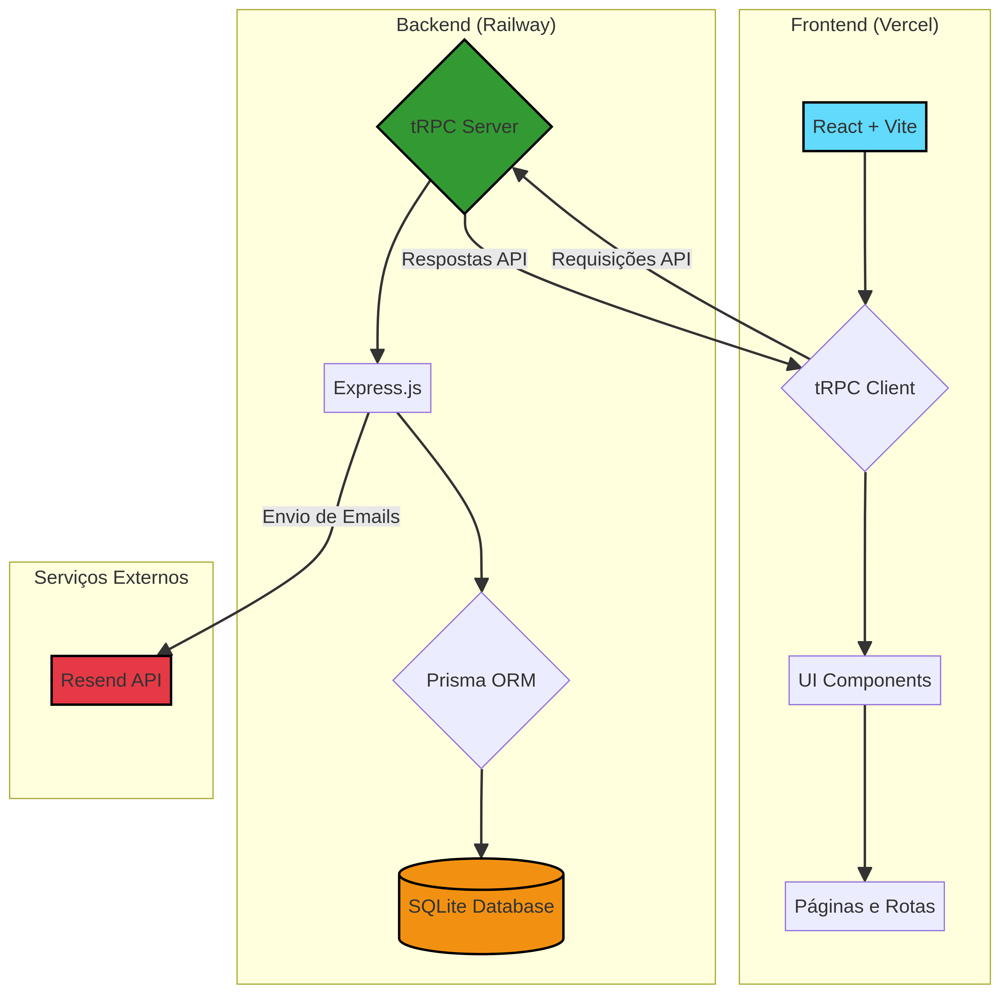
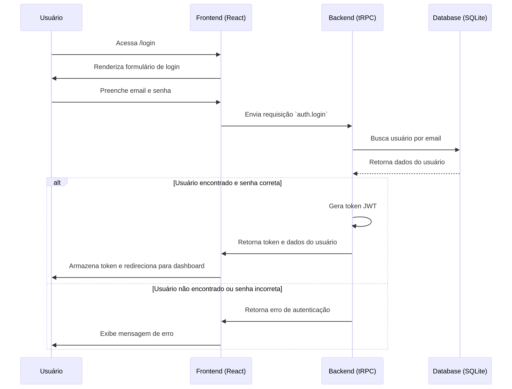
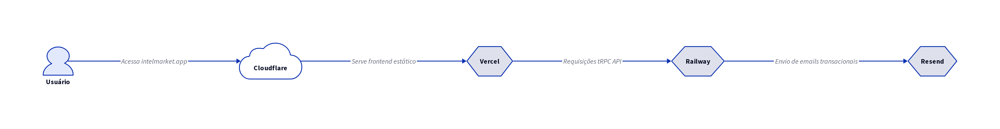

# Documentação Técnica - Intelmarket

**Autor:** Manus AI
**Data:** 24 de Novembro de 2025

## 1. Visão Geral da Arquitetura

A aplicação Intelmarket é um sistema de inteligência de mercado construído com uma arquitetura moderna e desacoplada, utilizando as melhores práticas de desenvolvimento web para garantir escalabilidade, performance e manutenibilidade.

### 1.1. Componentes Principais

A arquitetura é dividida em três componentes principais:

- **Frontend:** Aplicação single-page (SPA) construída com React e Vite, hospedada na Vercel.
- **Backend:** API baseada em tRPC e Express.js, hospedada na Railway.
- **Serviços Externos:** Serviços de terceiros para funcionalidades específicas, como envio de emails.

### 1.2. Fluxograma da Arquitetura

O fluxograma abaixo ilustra a interação entre os componentes da aplicação:

| Componente | Tecnologia | Responsabilidade |
| :--- | :--- | :--- |
| **Frontend** | React, Vite, tRPC Client | Interface do usuário, interações, consumo da API |
| **Backend** | Node.js, Express.js, tRPC Server, Prisma | Lógica de negócio, acesso ao banco de dados, autenticação |
| **Banco de Dados** | SQLite | Armazenamento de dados da aplicação |
| **Serviços Externos** | Resend | Envio de emails transacionais (convites, notificações) |

---

## 2. Fluxo de Autenticação

O sistema de autenticação foi migrado de um sistema OAuth externo para um sistema próprio baseado em **JSON Web Tokens (JWT)**, garantindo maior controle e segurança.

### 2.1. Diagrama de Sequência

O diagrama abaixo detalha o fluxo de autenticação, desde o login do usuário até a validação no backend:

### 2.2. Etapas do Fluxo

1. **Login:** O usuário insere email e senha no formulário de login.
2. **Requisição:** O frontend envia uma requisição `auth.login` para o backend tRPC.
3. **Validação:** O backend verifica as credenciais no banco de dados SQLite.
4. **Geração de Token:** Se as credenciais estiverem corretas, o backend gera um token JWT com as informações do usuário.
5. **Armazenamento:** O frontend armazena o token JWT no `localStorage`.
6. **Acesso:** O token é enviado em todas as requisições subsequentes para rotas protegidas.

---

## 3. Infraestrutura e Deploy

A aplicação é hospedada em plataformas serverless e de alta performance, garantindo escalabilidade automática e deploy contínuo.

### 3.1. Diagrama de Infraestrutura

O diagrama abaixo ilustra a infraestrutura de deploy e como os serviços se comunicam:

### 3.2. Plataformas Utilizadas

- **Vercel:** Hospedagem do frontend React, com deploy automático a cada push na branch `main` do GitHub.
- **Railway:** Hospedagem do backend Node.js, com deploy automático a cada push na branch `main`.
- **Cloudflare:** Gerenciamento de DNS e proxy reverso para o domínio `intelmarket.app`.
- **Resend:** Serviço de envio de emails transacionais, integrado ao backend.

---

## 4. Stack Tecnológico

| Camada | Tecnologia | Descrição |
| :--- | :--- | :--- |
| **Frontend** | React, Vite, TypeScript | Construção da interface do usuário |
| | Tailwind CSS, Shadcn/UI | Estilização e componentes de UI |
| | tRPC Client | Comunicação com a API |
| | Wouter | Gerenciamento de rotas |
| **Backend** | Node.js, Express.js | Ambiente de execução e servidor web |
| | tRPC Server | Criação de APIs type-safe |
| | Prisma | ORM para acesso ao banco de dados |
| | JWT (jsonwebtoken) | Geração e validação de tokens de autenticação |
| **Banco de Dados** | SQLite | Banco de dados relacional embarcado |
| **Deploy** | Vercel, Railway, GitHub Actions | Automação de build e deploy contínuo |
| **Serviços** | Resend | Envio de emails |

---

## 5. Conclusão

Esta documentação fornece uma visão completa da arquitetura, fluxo de autenticação e infraestrutura da aplicação Intelmarket. A estrutura modular e desacoplada permite fácil manutenção e escalabilidade futura.

Para mais detalhes sobre a implementação, consulte o código-fonte no repositório GitHub.
