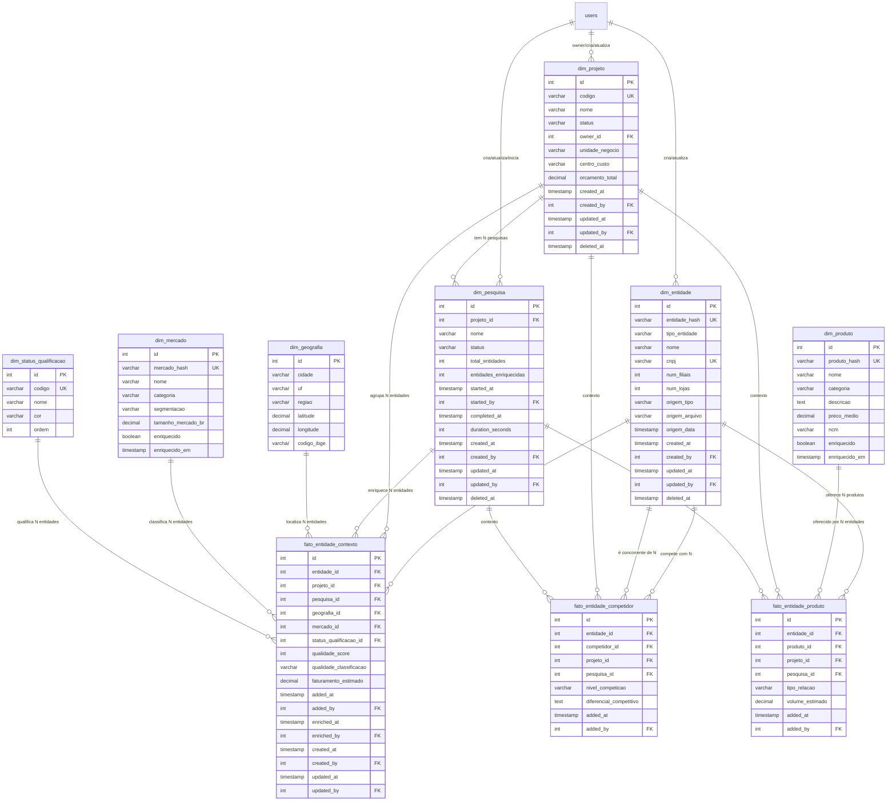

# 🎯 FASE 1.1: Modelo Dimensional Final - IntelMarket v3.0

**Data:** 01/12/2025  
**Status:** ✅ Aprovado pelo usuário  
**Participantes:** Engenheiro de Dados + Arquiteto da Informação + Analista de Inteligência de Mercado

---

## 📋 OBJETIVO

Definir o modelo dimensional DEFINITIVO do IntelMarket v3.0, incorporando:

- Todas as respostas validadas pelo usuário
- Campos de auditoria completos
- Campos de origem rastreáveis
- Campos de filiais/lojas
- Mercado padrão "NÃO CLASSIFICADO"
- Granularidade: Entidade + Projeto + Pesquisa

---

## 🧊 ARQUITETURA DIMENSIONAL

### **Tipo de Modelo:** Star Schema (Esquema Estrela)

### **Granularidade:** Entidade + Projeto + Pesquisa

### **Componentes:**

- **7 Dimensões** (dim\_\*)
- **1 Fato Central** (fato_entidade_contexto)
- **2 Fatos N:N** (fato_entidade_produto, fato_entidade_competidor)

---

## 📊 DIMENSÕES (7)

### **1. dim_entidade**

**Conceito:** Entidade única (cliente, lead ou concorrente)

**Regras de Negócio:**

- CNPJ único = entidade única (matriz ou filial)
- Se sem CNPJ: hash baseado em nome + cidade + uf
- Não duplicar: usar deduplicação (merge > 60%)

**Campos:**

```sql
CREATE TABLE dim_entidade (
  -- Identificação
  id SERIAL PRIMARY KEY,
  entidade_hash VARCHAR(64) UNIQUE NOT NULL, -- MD5(cnpj) ou MD5(nome+cidade+uf)
  tipo_entidade VARCHAR(20) NOT NULL CHECK (tipo_entidade IN ('cliente', 'lead', 'concorrente')),

  -- Dados básicos
  nome VARCHAR(255) NOT NULL,
  nome_fantasia VARCHAR(255),
  cnpj VARCHAR(18) UNIQUE, -- Formato: 12.345.678/0001-90
  email VARCHAR(255),
  telefone VARCHAR(20),
  site VARCHAR(255),

  -- Porte da empresa ⭐ NOVO
  num_filiais INTEGER DEFAULT 0, -- Quantas filiais tem
  num_lojas INTEGER DEFAULT 0, -- Quantas lojas físicas
  num_funcionarios INTEGER, -- Estimativa de funcionários

  -- Origem da criação ⭐ CRÍTICO
  origem_tipo VARCHAR(20) NOT NULL CHECK (origem_tipo IN ('importacao', 'ia_prompt', 'api', 'manual')),
  origem_arquivo VARCHAR(255), -- Nome do CSV (se importacao)
  origem_processo VARCHAR(100), -- Nome do processo (se ia_prompt)
  origem_prompt TEXT, -- Prompt usado (se ia_prompt)
  origem_confianca INTEGER CHECK (origem_confianca BETWEEN 0 AND 100), -- 0-100 (se ia_prompt)
  origem_data TIMESTAMP NOT NULL DEFAULT NOW(),
  origem_usuario_id INTEGER, -- FK → users (se manual/importacao)

  -- Auditoria ⭐ OBRIGATÓRIO
  created_at TIMESTAMP NOT NULL DEFAULT NOW(),
  created_by INTEGER, -- FK → users
  updated_at TIMESTAMP NOT NULL DEFAULT NOW(),
  updated_by INTEGER, -- FK → users
  deleted_at TIMESTAMP, -- Soft delete
  deleted_by INTEGER, -- FK → users

  -- Foreign Keys
  FOREIGN KEY (origem_usuario_id) REFERENCES users(id) ON DELETE SET NULL,
  FOREIGN KEY (created_by) REFERENCES users(id) ON DELETE SET NULL,
  FOREIGN KEY (updated_by) REFERENCES users(id) ON DELETE SET NULL,
  FOREIGN KEY (deleted_by) REFERENCES users(id) ON DELETE SET NULL
);
```

**Índices:**

```sql
-- Índices básicos
CREATE INDEX idx_entidade_hash ON dim_entidade(entidade_hash);
CREATE INDEX idx_entidade_tipo ON dim_entidade(tipo_entidade);
CREATE INDEX idx_entidade_cnpj ON dim_entidade(cnpj) WHERE cnpj IS NOT NULL;
CREATE INDEX idx_entidade_nome ON dim_entidade(nome);

-- Índices de origem
CREATE INDEX idx_entidade_origem_tipo ON dim_entidade(origem_tipo);
CREATE INDEX idx_entidade_origem_data ON dim_entidade(origem_data);

-- Índices de auditoria
CREATE INDEX idx_entidade_created_at ON dim_entidade(created_at);
CREATE INDEX idx_entidade_updated_at ON dim_entidade(updated_at);

-- Índice parcial (só não deletados)
CREATE INDEX idx_entidade_ativo ON dim_entidade(tipo_entidade, created_at)
WHERE deleted_at IS NULL;

-- Índice composto (tipo + origem)
CREATE INDEX idx_entidade_tipo_origem ON dim_entidade(tipo_entidade, origem_tipo);
```

**Total de Índices:** 10

---

### **2. dim_projeto**

**Conceito:** Agregador / Unidade de Negócio / Centro de Custos

**Regras de Negócio:**

- Cadastro prévio obrigatório (não criar inline na importação)
- Nome único por owner
- Soft delete (não deletar fisicamente)

**Campos:**

```sql
CREATE TABLE dim_projeto (
  -- Identificação
  id SERIAL PRIMARY KEY,
  codigo VARCHAR(50) UNIQUE, -- Código do centro de custos (opcional)
  nome VARCHAR(255) NOT NULL,
  descricao TEXT,

  -- Controle
  status VARCHAR(20) NOT NULL DEFAULT 'ativo' CHECK (status IN ('ativo', 'pausado', 'arquivado', 'concluido')),
  owner_id INTEGER NOT NULL, -- FK → users (responsável)

  -- Metadados de negócio
  unidade_negocio VARCHAR(100), -- Ex: "Vendas Sul", "Marketing Digital"
  centro_custo VARCHAR(50), -- Código contábil
  orcamento_total DECIMAL(15,2), -- Orçamento total do projeto

  -- Auditoria ⭐ OBRIGATÓRIO
  created_at TIMESTAMP NOT NULL DEFAULT NOW(),
  created_by INTEGER NOT NULL, -- FK → users
  updated_at TIMESTAMP NOT NULL DEFAULT NOW(),
  updated_by INTEGER, -- FK → users
  deleted_at TIMESTAMP, -- Soft delete
  deleted_by INTEGER, -- FK → users

  -- Foreign Keys
  FOREIGN KEY (owner_id) REFERENCES users(id) ON DELETE RESTRICT,
  FOREIGN KEY (created_by) REFERENCES users(id) ON DELETE SET NULL,
  FOREIGN KEY (updated_by) REFERENCES users(id) ON DELETE SET NULL,
  FOREIGN KEY (deleted_by) REFERENCES users(id) ON DELETE SET NULL,

  -- Constraints
  UNIQUE (nome, owner_id) -- Nome único por owner
);
```

**Índices:**

```sql
-- Índices básicos
CREATE INDEX idx_projeto_status ON dim_projeto(status);
CREATE INDEX idx_projeto_owner ON dim_projeto(owner_id);
CREATE INDEX idx_projeto_codigo ON dim_projeto(codigo) WHERE codigo IS NOT NULL;

-- Índices de auditoria
CREATE INDEX idx_projeto_created_at ON dim_projeto(created_at);

-- Índice parcial (só ativos não deletados)
CREATE INDEX idx_projeto_ativo ON dim_projeto(status, owner_id)
WHERE deleted_at IS NULL AND status = 'ativo';
```

**Total de Índices:** 5

---

### **3. dim_pesquisa**

**Conceito:** Snapshot de enriquecimento / Ação de qualificação coletiva

**Regras de Negócio:**

- Cadastro prévio obrigatório (não criar inline na importação)
- Nome único por projeto
- Apagar permitido (soft delete)
- Enriquecer sempre cria nova versão (nova pesquisa)

**Campos:**

```sql
CREATE TABLE dim_pesquisa (
  -- Identificação
  id SERIAL PRIMARY KEY,
  projeto_id INTEGER NOT NULL, -- FK → dim_projeto
  nome VARCHAR(255) NOT NULL,
  descricao TEXT,
  objetivo TEXT, -- Objetivo da pesquisa

  -- Controle de execução
  status VARCHAR(20) NOT NULL DEFAULT 'pendente' CHECK (status IN ('pendente', 'em_progresso', 'concluida', 'falhou', 'cancelada')),

  -- Métricas
  total_entidades INTEGER DEFAULT 0, -- Quantas entidades foram processadas
  entidades_enriquecidas INTEGER DEFAULT 0, -- Quantas completaram
  entidades_falhadas INTEGER DEFAULT 0, -- Quantas falharam
  qualidade_media DECIMAL(5,2), -- Qualidade média (0-100)

  -- Logs de execução ⭐ OBRIGATÓRIO
  started_at TIMESTAMP, -- Quando começou
  started_by INTEGER, -- FK → users (quem iniciou)
  completed_at TIMESTAMP, -- Quando terminou
  duration_seconds INTEGER, -- Duração em segundos
  error_message TEXT, -- Mensagem de erro (se falhou)

  -- Auditoria ⭐ OBRIGATÓRIO
  created_at TIMESTAMP NOT NULL DEFAULT NOW(),
  created_by INTEGER NOT NULL, -- FK → users
  updated_at TIMESTAMP NOT NULL DEFAULT NOW(),
  updated_by INTEGER, -- FK → users
  deleted_at TIMESTAMP, -- Soft delete
  deleted_by INTEGER, -- FK → users

  -- Foreign Keys
  FOREIGN KEY (projeto_id) REFERENCES dim_projeto(id) ON DELETE CASCADE,
  FOREIGN KEY (started_by) REFERENCES users(id) ON DELETE SET NULL,
  FOREIGN KEY (created_by) REFERENCES users(id) ON DELETE SET NULL,
  FOREIGN KEY (updated_by) REFERENCES users(id) ON DELETE SET NULL,
  FOREIGN KEY (deleted_by) REFERENCES users(id) ON DELETE SET NULL,

  -- Constraints
  UNIQUE (nome, projeto_id) -- Nome único por projeto
);
```

**Índices:**

```sql
-- Índices básicos
CREATE INDEX idx_pesquisa_projeto ON dim_pesquisa(projeto_id);
CREATE INDEX idx_pesquisa_status ON dim_pesquisa(status);

-- Índices de execução
CREATE INDEX idx_pesquisa_started_at ON dim_pesquisa(started_at);
CREATE INDEX idx_pesquisa_completed_at ON dim_pesquisa(completed_at);

-- Índices de auditoria
CREATE INDEX idx_pesquisa_created_at ON dim_pesquisa(created_at);

-- Índice parcial (só não deletadas)
CREATE INDEX idx_pesquisa_ativa ON dim_pesquisa(projeto_id, status)
WHERE deleted_at IS NULL;

-- Índice composto (projeto + status)
CREATE INDEX idx_pesquisa_projeto_status ON dim_pesquisa(projeto_id, status);
```

**Total de Índices:** 7

---

### **4. dim_geografia**

**Conceito:** Localização geográfica hierárquica (Região → Estado → Cidade)

**Regras de Negócio:**

- Populada a partir de `cidades_brasil` (seed)
- Validar cidade na importação (deve existir)
- Sugerir correções (Levenshtein distance)

**Campos:**

```sql
CREATE TABLE dim_geografia (
  -- Identificação
  id SERIAL PRIMARY KEY,
  cidade VARCHAR(100) NOT NULL,
  uf VARCHAR(2) NOT NULL,
  regiao VARCHAR(20), -- Norte, Nordeste, Centro-Oeste, Sudeste, Sul

  -- Dados geográficos
  latitude DECIMAL(10,8),
  longitude DECIMAL(11,8),
  codigo_ibge VARCHAR(10),
  populacao INTEGER,
  pib_per_capita DECIMAL(12,2),

  -- Auditoria ⭐ OBRIGATÓRIO
  created_at TIMESTAMP NOT NULL DEFAULT NOW(),
  created_by INTEGER,
  updated_at TIMESTAMP NOT NULL DEFAULT NOW(),
  updated_by INTEGER,

  -- Foreign Keys
  FOREIGN KEY (created_by) REFERENCES users(id) ON DELETE SET NULL,
  FOREIGN KEY (updated_by) REFERENCES users(id) ON DELETE SET NULL,

  -- Constraints
  UNIQUE (cidade, uf)
);
```

**Índices:**

```sql
-- Índices básicos
CREATE INDEX idx_geografia_uf ON dim_geografia(uf);
CREATE INDEX idx_geografia_regiao ON dim_geografia(regiao);
CREATE INDEX idx_geografia_codigo_ibge ON dim_geografia(codigo_ibge) WHERE codigo_ibge IS NOT NULL;

-- Índice composto (cidade + uf)
CREATE INDEX idx_geografia_cidade_uf ON dim_geografia(cidade, uf);

-- Índice para busca textual
CREATE INDEX idx_geografia_cidade_trgm ON dim_geografia USING gin(cidade gin_trgm_ops);
```

**Total de Índices:** 5

**Nota:** Requer extensão `pg_trgm` para busca textual:

```sql
CREATE EXTENSION IF NOT EXISTS pg_trgm;
```

---

### **5. dim_mercado**

**Conceito:** Mercado/setor de atuação

**Regras de Negócio:**

- Mercado padrão "NÃO CLASSIFICADO" (id = 1, criado no seed)
- Deduplicação por `mercado_hash`
- Cache de enriquecimento (TTL 90 dias)

**Campos:**

```sql
CREATE TABLE dim_mercado (
  -- Identificação
  id SERIAL PRIMARY KEY,
  mercado_hash VARCHAR(64) UNIQUE NOT NULL, -- MD5(nome + categoria)
  nome VARCHAR(255) NOT NULL,
  categoria VARCHAR(100), -- Ex: "B2B", "B2C", "B2B2C", "Governo"

  -- Dados de mercado (enriquecidos)
  segmentacao VARCHAR(255),
  tamanho_mercado_br DECIMAL(15,2), -- Em R$
  crescimento_anual_pct DECIMAL(5,2), -- %
  tendencias TEXT[], -- Array de tendências
  principais_players TEXT[], -- Array de principais empresas

  -- Cache de enriquecimento
  enriquecido BOOLEAN DEFAULT FALSE,
  enriquecido_em TIMESTAMP,
  enriquecido_por VARCHAR(50), -- 'llm', 'api', 'manual'

  -- Auditoria ⭐ OBRIGATÓRIO
  created_at TIMESTAMP NOT NULL DEFAULT NOW(),
  created_by INTEGER,
  updated_at TIMESTAMP NOT NULL DEFAULT NOW(),
  updated_by INTEGER,

  -- Foreign Keys
  FOREIGN KEY (created_by) REFERENCES users(id) ON DELETE SET NULL,
  FOREIGN KEY (updated_by) REFERENCES users(id) ON DELETE SET NULL
);
```

**Índices:**

```sql
-- Índices básicos
CREATE INDEX idx_mercado_hash ON dim_mercado(mercado_hash);
CREATE INDEX idx_mercado_categoria ON dim_mercado(categoria);
CREATE INDEX idx_mercado_nome ON dim_mercado(nome);

-- Índice de cache
CREATE INDEX idx_mercado_enriquecido ON dim_mercado(enriquecido, enriquecido_em);

-- Índice para busca textual
CREATE INDEX idx_mercado_nome_trgm ON dim_mercado USING gin(nome gin_trgm_ops);
```

**Total de Índices:** 5

**Seed Obrigatório:**

```sql
INSERT INTO dim_mercado (id, mercado_hash, nome, categoria, enriquecido, created_at)
VALUES (1, MD5('NÃO CLASSIFICADO'), 'NÃO CLASSIFICADO', NULL, FALSE, NOW());
```

---

### **6. dim_produto**

**Conceito:** Produto ou serviço oferecido

**Regras de Negócio:**

- Deduplicação por `produto_hash`
- Cache de enriquecimento (TTL 90 dias)

**Campos:**

```sql
CREATE TABLE dim_produto (
  -- Identificação
  id SERIAL PRIMARY KEY,
  produto_hash VARCHAR(64) UNIQUE NOT NULL, -- MD5(nome + categoria)
  nome VARCHAR(255) NOT NULL,
  categoria VARCHAR(100),

  -- Dados do produto (enriquecidos)
  descricao TEXT,
  preco_medio DECIMAL(12,2),
  unidade VARCHAR(20), -- kg, unidade, m², litro, etc
  ncm VARCHAR(10), -- Nomenclatura Comum do Mercosul

  -- Cache de enriquecimento
  enriquecido BOOLEAN DEFAULT FALSE,
  enriquecido_em TIMESTAMP,
  enriquecido_por VARCHAR(50), -- 'llm', 'api', 'manual'

  -- Auditoria ⭐ OBRIGATÓRIO
  created_at TIMESTAMP NOT NULL DEFAULT NOW(),
  created_by INTEGER,
  updated_at TIMESTAMP NOT NULL DEFAULT NOW(),
  updated_by INTEGER,

  -- Foreign Keys
  FOREIGN KEY (created_by) REFERENCES users(id) ON DELETE SET NULL,
  FOREIGN KEY (updated_by) REFERENCES users(id) ON DELETE SET NULL
);
```

**Índices:**

```sql
-- Índices básicos
CREATE INDEX idx_produto_hash ON dim_produto(produto_hash);
CREATE INDEX idx_produto_categoria ON dim_produto(categoria);
CREATE INDEX idx_produto_nome ON dim_produto(nome);
CREATE INDEX idx_produto_ncm ON dim_produto(ncm) WHERE ncm IS NOT NULL;

-- Índice de cache
CREATE INDEX idx_produto_enriquecido ON dim_produto(enriquecido, enriquecido_em);

-- Índice para busca textual
CREATE INDEX idx_produto_nome_trgm ON dim_produto USING gin(nome gin_trgm_ops);
```

**Total de Índices:** 6

---

### **7. dim_status_qualificacao**

**Conceito:** Status de qualificação (tabela de domínio)

**Regras de Negócio:**

- Tabela de domínio (valores fixos)
- Populada no seed
- Não permite inserção/deleção pelo usuário

**Campos:**

```sql
CREATE TABLE dim_status_qualificacao (
  -- Identificação
  id SERIAL PRIMARY KEY,
  codigo VARCHAR(50) UNIQUE NOT NULL, -- ativo, inativo, prospect, etc
  nome VARCHAR(100) NOT NULL,
  descricao TEXT,
  cor VARCHAR(7), -- Hex color para UI (#00FF00)
  ordem INTEGER, -- Para ordenação

  -- Auditoria ⭐ OBRIGATÓRIO
  created_at TIMESTAMP NOT NULL DEFAULT NOW(),
  created_by INTEGER,
  updated_at TIMESTAMP NOT NULL DEFAULT NOW(),
  updated_by INTEGER,

  -- Foreign Keys
  FOREIGN KEY (created_by) REFERENCES users(id) ON DELETE SET NULL,
  FOREIGN KEY (updated_by) REFERENCES users(id) ON DELETE SET NULL
);
```

**Índices:**

```sql
-- Índices básicos
CREATE INDEX idx_status_codigo ON dim_status_qualificacao(codigo);
CREATE INDEX idx_status_ordem ON dim_status_qualificacao(ordem);
```

**Total de Índices:** 2

**Seed Obrigatório:**

```sql
INSERT INTO dim_status_qualificacao (codigo, nome, descricao, cor, ordem) VALUES
('ativo', 'Ativo', 'Cliente ativo com compras recentes', '#22C55E', 1),
('inativo', 'Inativo', 'Cliente inativo sem compras recentes', '#EF4444', 2),
('prospect', 'Prospect', 'Potencial cliente ainda não convertido', '#3B82F6', 3),
('lead_qualificado', 'Lead Qualificado', 'Lead com alta probabilidade de conversão', '#10B981', 4),
('lead_desqualificado', 'Lead Desqualificado', 'Lead com baixa probabilidade de conversão', '#F59E0B', 5);
```

---

## 🎯 FATO CENTRAL

### **fato_entidade_contexto**

**Conceito:** Existência e estado de uma entidade em um contexto (projeto + pesquisa)

**Granularidade:** Entidade + Projeto + Pesquisa

**Regras de Negócio:**

- Não pode duplicar contexto (UNIQUE constraint)
- Status pode ser diferente por projeto/pesquisa
- Mercado pode ser diferente por projeto/pesquisa
- pesquisa_id pode ser NULL (se não enriquecido ainda)

**Campos:**

```sql
CREATE TABLE fato_entidade_contexto (
  -- Identificação
  id SERIAL PRIMARY KEY,

  -- Chaves dimensionais (FKs) ⭐ CRÍTICO
  entidade_id INTEGER NOT NULL, -- FK → dim_entidade
  projeto_id INTEGER NOT NULL, -- FK → dim_projeto
  pesquisa_id INTEGER, -- FK → dim_pesquisa (NULL se não enriquecido ainda)
  geografia_id INTEGER, -- FK → dim_geografia
  mercado_id INTEGER DEFAULT 1, -- FK → dim_mercado (padrão: "NÃO CLASSIFICADO")
  status_qualificacao_id INTEGER NOT NULL, -- FK → dim_status_qualificacao

  -- Métricas (fatos)
  qualidade_score INTEGER CHECK (qualidade_score BETWEEN 0 AND 100),
  qualidade_classificacao VARCHAR(1) CHECK (qualidade_classificacao IN ('A', 'B', 'C', 'D')),
  faturamento_estimado DECIMAL(15,2),
  num_estabelecimentos INTEGER,
  num_funcionarios INTEGER,

  -- Metadados
  observacoes TEXT,
  tags TEXT[], -- Array de tags para filtros

  -- Logs de contexto ⭐ OBRIGATÓRIO
  added_at TIMESTAMP NOT NULL DEFAULT NOW(), -- Quando foi adicionado ao projeto/pesquisa
  added_by INTEGER, -- FK → users (quem adicionou)
  enriched_at TIMESTAMP, -- Quando foi enriquecido
  enriched_by INTEGER, -- FK → users (quem enriqueceu)

  -- Auditoria ⭐ OBRIGATÓRIO
  created_at TIMESTAMP NOT NULL DEFAULT NOW(),
  created_by INTEGER,
  updated_at TIMESTAMP NOT NULL DEFAULT NOW(),
  updated_by INTEGER,

  -- Foreign Keys
  FOREIGN KEY (entidade_id) REFERENCES dim_entidade(id) ON DELETE CASCADE,
  FOREIGN KEY (projeto_id) REFERENCES dim_projeto(id) ON DELETE CASCADE,
  FOREIGN KEY (pesquisa_id) REFERENCES dim_pesquisa(id) ON DELETE SET NULL,
  FOREIGN KEY (geografia_id) REFERENCES dim_geografia(id) ON DELETE SET NULL,
  FOREIGN KEY (mercado_id) REFERENCES dim_mercado(id) ON DELETE SET NULL,
  FOREIGN KEY (status_qualificacao_id) REFERENCES dim_status_qualificacao(id) ON DELETE RESTRICT,
  FOREIGN KEY (added_by) REFERENCES users(id) ON DELETE SET NULL,
  FOREIGN KEY (enriched_by) REFERENCES users(id) ON DELETE SET NULL,
  FOREIGN KEY (created_by) REFERENCES users(id) ON DELETE SET NULL,
  FOREIGN KEY (updated_by) REFERENCES users(id) ON DELETE SET NULL,

  -- Constraints
  UNIQUE (entidade_id, projeto_id, pesquisa_id) -- Não pode duplicar contexto
);
```

**Índices:**

```sql
-- Índices de chaves dimensionais
CREATE INDEX idx_fec_entidade ON fato_entidade_contexto(entidade_id);
CREATE INDEX idx_fec_projeto ON fato_entidade_contexto(projeto_id);
CREATE INDEX idx_fec_pesquisa ON fato_entidade_contexto(pesquisa_id) WHERE pesquisa_id IS NOT NULL;
CREATE INDEX idx_fec_geografia ON fato_entidade_contexto(geografia_id) WHERE geografia_id IS NOT NULL;
CREATE INDEX idx_fec_mercado ON fato_entidade_contexto(mercado_id);
CREATE INDEX idx_fec_status ON fato_entidade_contexto(status_qualificacao_id);

-- Índices compostos (queries frequentes)
CREATE INDEX idx_fec_entidade_projeto ON fato_entidade_contexto(entidade_id, projeto_id);
CREATE INDEX idx_fec_projeto_pesquisa ON fato_entidade_contexto(projeto_id, pesquisa_id);
CREATE INDEX idx_fec_entidade_projeto_pesquisa ON fato_entidade_contexto(entidade_id, projeto_id, pesquisa_id);
CREATE INDEX idx_fec_projeto_status ON fato_entidade_contexto(projeto_id, status_qualificacao_id);
CREATE INDEX idx_fec_projeto_mercado ON fato_entidade_contexto(projeto_id, mercado_id);
CREATE INDEX idx_fec_projeto_geografia ON fato_entidade_contexto(projeto_id, geografia_id);

-- Índices de logs
CREATE INDEX idx_fec_added_at ON fato_entidade_contexto(added_at);
CREATE INDEX idx_fec_enriched_at ON fato_entidade_contexto(enriched_at) WHERE enriched_at IS NOT NULL;

-- Índice de qualidade
CREATE INDEX idx_fec_qualidade ON fato_entidade_contexto(qualidade_score) WHERE qualidade_score IS NOT NULL;

-- Índice parcial (só enriquecidos)
CREATE INDEX idx_fec_enriquecido ON fato_entidade_contexto(projeto_id, pesquisa_id, qualidade_score)
WHERE pesquisa_id IS NOT NULL AND qualidade_score IS NOT NULL;

-- Índice GIN para tags
CREATE INDEX idx_fec_tags ON fato_entidade_contexto USING gin(tags);
```

**Total de Índices:** 17

---

## 🔗 FATOS N:N

### **1. fato_entidade_produto**

**Conceito:** Entidade oferece N produtos em um contexto

**Regras de Negócio:**

- Não pode duplicar (entidade + produto + projeto + pesquisa)
- tipo_relacao: principal, secundario, complementar

**Campos:**

```sql
CREATE TABLE fato_entidade_produto (
  -- Identificação
  id SERIAL PRIMARY KEY,

  -- Chaves dimensionais
  entidade_id INTEGER NOT NULL, -- FK → dim_entidade
  produto_id INTEGER NOT NULL, -- FK → dim_produto
  projeto_id INTEGER NOT NULL, -- FK → dim_projeto
  pesquisa_id INTEGER, -- FK → dim_pesquisa

  -- Metadados
  tipo_relacao VARCHAR(20) CHECK (tipo_relacao IN ('principal', 'secundario', 'complementar')),
  volume_estimado DECIMAL(12,2),
  preco_praticado DECIMAL(12,2),

  -- Logs
  added_at TIMESTAMP NOT NULL DEFAULT NOW(),
  added_by INTEGER,

  -- Auditoria ⭐ OBRIGATÓRIO
  created_at TIMESTAMP NOT NULL DEFAULT NOW(),
  created_by INTEGER,
  updated_at TIMESTAMP NOT NULL DEFAULT NOW(),
  updated_by INTEGER,

  -- Foreign Keys
  FOREIGN KEY (entidade_id) REFERENCES dim_entidade(id) ON DELETE CASCADE,
  FOREIGN KEY (produto_id) REFERENCES dim_produto(id) ON DELETE CASCADE,
  FOREIGN KEY (projeto_id) REFERENCES dim_projeto(id) ON DELETE CASCADE,
  FOREIGN KEY (pesquisa_id) REFERENCES dim_pesquisa(id) ON DELETE SET NULL,
  FOREIGN KEY (added_by) REFERENCES users(id) ON DELETE SET NULL,
  FOREIGN KEY (created_by) REFERENCES users(id) ON DELETE SET NULL,
  FOREIGN KEY (updated_by) REFERENCES users(id) ON DELETE SET NULL,

  -- Constraints
  UNIQUE (entidade_id, produto_id, projeto_id, pesquisa_id)
);
```

**Índices:**

```sql
-- Índices básicos
CREATE INDEX idx_fep_entidade ON fato_entidade_produto(entidade_id);
CREATE INDEX idx_fep_produto ON fato_entidade_produto(produto_id);
CREATE INDEX idx_fep_projeto ON fato_entidade_produto(projeto_id);
CREATE INDEX idx_fep_pesquisa ON fato_entidade_produto(pesquisa_id) WHERE pesquisa_id IS NOT NULL;

-- Índices compostos
CREATE INDEX idx_fep_entidade_projeto ON fato_entidade_produto(entidade_id, projeto_id);
CREATE INDEX idx_fep_produto_projeto ON fato_entidade_produto(produto_id, projeto_id);

-- Índice de tipo
CREATE INDEX idx_fep_tipo ON fato_entidade_produto(tipo_relacao);
```

**Total de Índices:** 7

---

### **2. fato_entidade_competidor**

**Conceito:** Entidade compete com N outras entidades em um contexto

**Regras de Negócio:**

- Não pode duplicar (entidade + competidor + projeto + pesquisa)
- nivel_competicao: direto, indireto, potencial

**Campos:**

```sql
CREATE TABLE fato_entidade_competidor (
  -- Identificação
  id SERIAL PRIMARY KEY,

  -- Chaves dimensionais
  entidade_id INTEGER NOT NULL, -- FK → dim_entidade (cliente/lead)
  competidor_id INTEGER NOT NULL, -- FK → dim_entidade (concorrente)
  projeto_id INTEGER NOT NULL, -- FK → dim_projeto
  pesquisa_id INTEGER, -- FK → dim_pesquisa

  -- Metadados
  nivel_competicao VARCHAR(20) CHECK (nivel_competicao IN ('direto', 'indireto', 'potencial')),
  diferencial_competitivo TEXT,

  -- Logs
  added_at TIMESTAMP NOT NULL DEFAULT NOW(),
  added_by INTEGER,

  -- Auditoria ⭐ OBRIGATÓRIO
  created_at TIMESTAMP NOT NULL DEFAULT NOW(),
  created_by INTEGER,
  updated_at TIMESTAMP NOT NULL DEFAULT NOW(),
  updated_by INTEGER,

  -- Foreign Keys
  FOREIGN KEY (entidade_id) REFERENCES dim_entidade(id) ON DELETE CASCADE,
  FOREIGN KEY (competidor_id) REFERENCES dim_entidade(id) ON DELETE CASCADE,
  FOREIGN KEY (projeto_id) REFERENCES dim_projeto(id) ON DELETE CASCADE,
  FOREIGN KEY (pesquisa_id) REFERENCES dim_pesquisa(id) ON DELETE SET NULL,
  FOREIGN KEY (added_by) REFERENCES users(id) ON DELETE SET NULL,
  FOREIGN KEY (created_by) REFERENCES users(id) ON DELETE SET NULL,
  FOREIGN KEY (updated_by) REFERENCES users(id) ON DELETE SET NULL,

  -- Constraints
  UNIQUE (entidade_id, competidor_id, projeto_id, pesquisa_id),
  CHECK (entidade_id != competidor_id) -- Não pode competir consigo mesmo
);
```

**Índices:**

```sql
-- Índices básicos
CREATE INDEX idx_feco_entidade ON fato_entidade_competidor(entidade_id);
CREATE INDEX idx_feco_competidor ON fato_entidade_competidor(competidor_id);
CREATE INDEX idx_feco_projeto ON fato_entidade_competidor(projeto_id);
CREATE INDEX idx_feco_pesquisa ON fato_entidade_competidor(pesquisa_id) WHERE pesquisa_id IS NOT NULL;

-- Índices compostos
CREATE INDEX idx_feco_entidade_projeto ON fato_entidade_competidor(entidade_id, projeto_id);
CREATE INDEX idx_feco_competidor_projeto ON fato_entidade_competidor(competidor_id, projeto_id);

-- Índice de nível
CREATE INDEX idx_feco_nivel ON fato_entidade_competidor(nivel_competicao);
```

**Total de Índices:** 7

---

## 📊 RESUMO DE ÍNDICES

| Tabela                   | Índices | Total  |
| ------------------------ | ------- | ------ |
| dim_entidade             | 10      | 10     |
| dim_projeto              | 5       | 5      |
| dim_pesquisa             | 7       | 7      |
| dim_geografia            | 5       | 5      |
| dim_mercado              | 5       | 5      |
| dim_produto              | 6       | 6      |
| dim_status_qualificacao  | 2       | 2      |
| fato_entidade_contexto   | 17      | 17     |
| fato_entidade_produto    | 7       | 7      |
| fato_entidade_competidor | 7       | 7      |
| **TOTAL**                | **71**  | **71** |

---

## 📋 REGRAS DE NEGÓCIO CONSOLIDADAS

### **1. Entidade Única**

- CNPJ único = entidade única (matriz ou filial)
- Se sem CNPJ: hash baseado em nome + cidade + uf
- Deduplicação: merge > 60% sempre pergunta ao usuário

### **2. Projeto e Pesquisa**

- Cadastro prévio obrigatório (não criar inline)
- Nome único por owner (projeto)
- Nome único por projeto (pesquisa)

### **3. Status Flutua**

- Cliente pode ter status diferente por projeto/pesquisa
- Status está em `fato_entidade_contexto` (não em `dim_entidade`)

### **4. Enriquecimento**

- Enriquecer sempre cria nova versão (nova pesquisa)
- Apagar pesquisa permitido (soft delete)
- Mercado padrão: "NÃO CLASSIFICADO" (id = 1)

### **5. Filiais e Lojas**

- Registrar `num_filiais` e `num_lojas` em `dim_entidade`
- Ajuda a dimensionar porte da empresa

### **6. Origem Rastreável**

- Registrar origem_tipo, origem_arquivo, origem_processo, origem_prompt
- Permite rastrear como cada entidade foi criada

### **7. Auditoria Completa**

- TODAS as tabelas têm: created_at, created_by, updated_at, updated_by
- Fatos têm TAMBÉM: added_at, added_by
- dim_pesquisa tem TAMBÉM: started_at, started_by, completed_at

### **8. Soft Delete**

- dim_entidade, dim_projeto, dim_pesquisa têm soft delete
- Marcar como deletado (não deletar fisicamente)
- Recuperação possível

---

## 🎯 DIAGRAMA ER (Mermaid)



---

## ✅ VALIDAÇÃO FINAL

### **Checklist:**

- [x] 7 dimensões definidas
- [x] 1 fato central definido
- [x] 2 fatos N:N definidos
- [x] Todos os campos de auditoria
- [x] Todos os campos de origem
- [x] Campos de filiais/lojas
- [x] Mercado padrão "NÃO CLASSIFICADO"
- [x] 71 índices otimizados
- [x] Todas as Foreign Keys
- [x] Todas as constraints (UNIQUE, CHECK)
- [x] Soft delete (entidade, projeto, pesquisa)
- [x] Regras de negócio documentadas
- [x] Diagrama ER criado

---

## 🎯 PRÓXIMOS PASSOS

1. **FASE 1.2:** Revisar modelo existente e identificar gaps
2. **FASE 1.3:** Criar migration SQL e executar no banco
3. **FASE 1.4:** Atualizar schema Drizzle

---

**Documento completo e aprovado! ✅**
