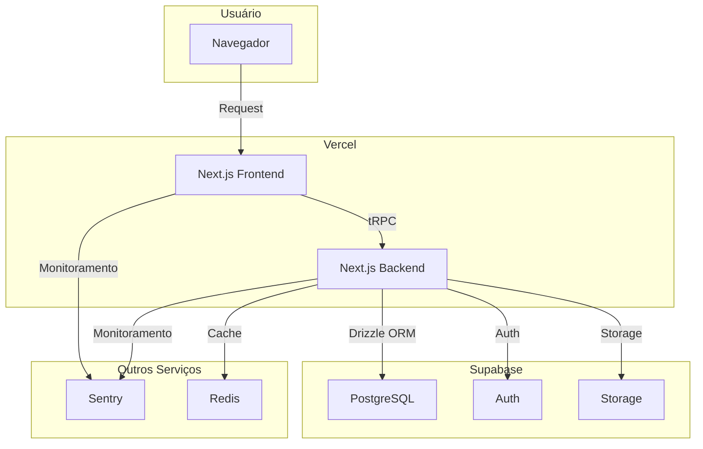

# 🏛️ Arquitetura do Sistema

Este documento descreve a arquitetura do projeto Intelmarket Next.js.

## 📋 Índice

- [Visão Geral](#visão-geral)
- [Arquitetura Frontend](#arquitetura-frontend)
- [Arquitetura Backend](#arquitetura-backend)
- [Arquitetura de Dados](#arquitetura-de-dados)
- [Infraestrutura](#infraestrutura)
- [Fluxo de Dados](#fluxo-de-dados)
- [Diagrama de Arquitetura](#diagrama-de-arquitetura)

---

## 🚀 Visão Geral

A arquitetura é baseada em uma **monorepo** com Next.js, utilizando uma abordagem **full-stack** com React Server Components (RSC) e API Routes.

**Princípios de Design:**
- **Modularidade:** Componentes e serviços desacoplados.
- **Escalabilidade:** Arquitetura serverless com Vercel e Supabase.
- **Tipagem Forte:** 100% TypeScript para segurança e manutenibilidade.
- **Performance:** Otimizações de build, cache e renderização.
- **Observabilidade:** Monitoramento completo com Sentry.

---

## 🎨 Arquitetura Frontend

### Estrutura de Diretórios

```
app/
├── (auth)/         # Rotas de autenticação
├── (dashboard)/      # Rotas protegidas do dashboard
├── api/              # API Routes
├── layout.tsx        # Layout principal
└── page.tsx          # Homepage

components/
├── ui/               # Componentes de UI (Shadcn)
├── shared/           # Componentes compartilhados
└── features/         # Componentes de features específicas

lib/
├── hooks/            # Hooks customizados
├── utils.ts          # Funções utilitárias
└── ...

styles/
└── globals.css       # Estilos globais
```

### Gerenciamento de Estado

- **React Query:** Para caching de dados do servidor, revalidação e mutações.
- **Zustand:** Para estado global da UI (ex: estado de modais, tema).

### Componentes

- **React Server Components (RSC):** Para renderização no servidor e acesso direto a dados.
- **Client Components:** Para interatividade e hooks de cliente.
- **Shadcn/UI:** Biblioteca de componentes de UI acessíveis e customizáveis.

---

## ⚙️ Arquitetura Backend

### API Routes

- **tRPC:** Para comunicação type-safe entre frontend e backend.
- **REST APIs:** Para webhooks e endpoints públicos.

### Estrutura de Diretórios

```
server/
├── routers/          # Routers do tRPC
│   ├── _app.ts       # Router principal
│   └── ...
├── services/         # Lógica de negócio
├── db/               # Acesso ao banco de dados
└── ...
```

### Lógica de Negócio

- **Services:** Camada de serviço que encapsula a lógica de negócio.
- **Repositories:** Padrão de repositório para abstrair o acesso a dados.

---

## 💾 Arquitetura de Dados

### Banco de Dados

- **PostgreSQL:** Banco de dados relacional gerenciado pelo Supabase.
- **Drizzle ORM:** ORM TypeScript-first para interagir com o banco de dados.

### Migrações

- **Drizzle Kit:** Ferramenta para gerar e aplicar migrações de schema.

### Cache

- **Redis:** Para caching de sessões, dados frequentes e rate limiting.

---

## 🏗️ Infraestrutura

### Hosting

- **Vercel:** Para hosting da aplicação Next.js, com deploy contínuo e escalabilidade automática.

### Banco de Dados e Autenticação

- **Supabase:** Plataforma open-source que oferece banco de dados PostgreSQL, autenticação, storage e mais.

### Monitoramento

- **Sentry:** Para error tracking, performance monitoring e alertas.

### CI/CD

- **GitHub Actions:** Para automação de testes, build e deploy.

### Containerization

- **Docker:** Para criar um ambiente de desenvolvimento consistente e para deploy em outras plataformas.

---

## 🌊 Fluxo de Dados

1. **Request do Usuário:** Usuário acessa uma página no navegador.
2. **Next.js Server:** Renderiza a página (RSC) ou serve os assets (Client Components).
3. **tRPC:** Client Components fazem chamadas tRPC para a API.
4. **API Route:** API Route processa a requisição, chama o service apropriado.
5. **Service:** Executa a lógica de negócio, utiliza o repositório para acessar dados.
6. **Drizzle ORM:** Repositório usa Drizzle para fazer query no banco de dados.
7. **PostgreSQL:** Banco de dados retorna os dados.
8. **Response:** Dados são retornados ao frontend e renderizados.

---

## 🗺️ Diagrama de Arquitetura


